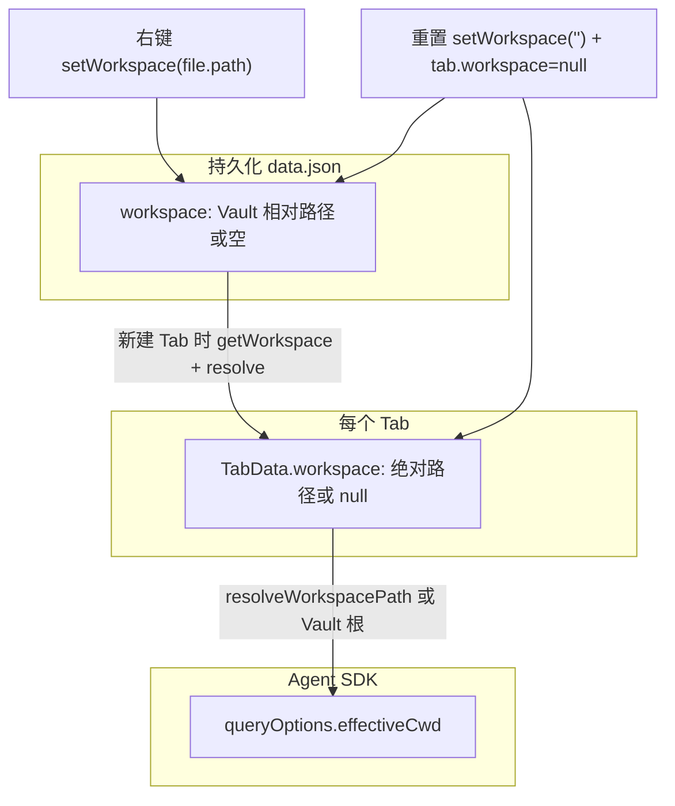

# 实现方案：工作目录与右键切换（代码事实与复现步骤）

> 本文档描述**当前仓库已实现**的原理与文件职责，并给出在**另一同源分支**上复现时的改动清单。代码片段取自本仓库对应路径（行号随提交可能漂移，请以符号检索为准）。

---

## 1. 核心原理（一段话）

**持久化层**在 Obsidian 插件 `data.json` 中保存 **Vault 相对路径** `workspace`；**每个聊天 Tab** 在创建时把该配置解析为 **绝对目录路径** 写入 `TabData.workspace`（或 `null` 表示 Vault 根）。**发送消息、初始化 ClaudianService、Bang Bash** 等通过 `resolveWorkspacePath(tab.workspace, vaultPath) ?? vaultPath` 得到 **`effectiveCwd`** 交给 Claude Agent SDK。**右键「设为工作空间」只更新持久化与 Ribbon**，按定稿**不**改写已打开 Tab 的快照，因此**新建 Tab** 才会用上新目录；**重置**则清空持久化并将当前视图内所有 Tab 的 `workspace` 置 `null`。

---

## 2. 数据流总览



### 2.1 多页签：各自 `workspace` 如何挂上、会不会串台

**结论（代码事实）**：每个聊天页签对应一个 `TabData`，字段 **`workspace`**（绝对路径或 `null`）只在**创建/恢复**时写入；运行期除**全局重置**外不会批量改写。`effectiveCwd`、文档胶囊、`BangBash` 的 `getCwd` 都通过闭包或参数绑定到**该 Tab 实例**，切换页签即切换绑定，**不会在 SDK 层把 Tab A 的目录当成 Tab B 的目录**。

| 问题 | 答案 |
|------|------|
| 多个页签共用一个工作空间吗？ | **不强制共用**。每个页签有自己的 `tab.workspace`；可相同（例如都在 Vault 根）、也可不同（不同时间新建或恢复布局时各自快照不同）。 |
| 右键「设为工作空间」会改所有页签吗？ | **不会**。只更新 `data.json`；**仅之后新建的页签**会读到新值。已有页签仍用创建时的快照。 |
| 会不会「搞混」？ | **逻辑上不混 cwd**；**UI 上可能**混观感：Ribbon 跟全局持久化，副标题跟**当前激活页签**，右键改全局后可能短暂不一致。 |
| 两个 Obsidian 里各开一个 Claudian 视图？ | 每个视图有自己的 `TabManager`；重置时 `getAllViews()` 会遍历，每视图内多页签一并 `workspace = null`（与 `main.ts` / `ClaudianView` 实现一致）。 |

**持久化与多页签**：`TabManager.getPersistedState()` 对每个 `tab` 写入 `workspace: tab.workspace`（绝对路径）；`restoreState` 用 `createTabWithWorkspace(..., tabState.workspace)` **按页签还原**，因此重启后仍可保持「Tab1=A、Tab2=B」。

```502:511:src/features/chat/tabs/TabManager.ts
  getPersistedState(): PersistedTabManagerState {
    const openTabs: PersistedTabState[] = [];

    for (const tab of this.tabs.values()) {
      openTabs.push({
        tabId: tab.id,
        conversationId: tab.conversationId,
        workspace: tab.workspace,
      });
    }
```

**新建页签时默认从哪读**：无 `persistedWorkspace` 时走 `storage.getWorkspace()`，再 `resolveWorkspacePath` 写入**新 Tab**（见下文 3.4）。

---

## 3. 关键代码事实（摘自本仓库）

### 3.1 右键菜单：仅文件夹可「设为工作空间」

注册 `app.workspace.on('file-menu')`：对 `TFolder` 增加「设为工作空间」项——校验 Vault 边界后 `storage.setWorkspace(file.path)`（**注意**：`file.path` 为 Obsidian 管理的 **Vault 相对路径**），再 `Notice` 与 `updateRibbonTooltipFromStorage()`。

```94:114:src/main.ts
    this.registerEvent(
      this.app.workspace.on('file-menu', (menu, file) => {
        if (file instanceof TFolder) {
          // 1. 设为工作空间
          menu.addItem((item) =>
            item
              .setIcon(CLAUDIAN_ICON_NAME)
              .setTitle(t('contextMenu.setWorkspace'))
              .onClick(async () => {
                const vaultPath = getVaultPath(this.app);
                if (!vaultPath) return;
                const folderPath = path.join(vaultPath, file.path);
                if (!isPathWithinVault(folderPath, vaultPath)) {
                  new Notice(t('contextMenu.invalidPath'));
                  return;
                }
                await this.storage.setWorkspace(file.path);
                new Notice(t('contextMenu.workspaceSet'));
                await this.updateRibbonTooltipFromStorage();
              })
          );
```

**原理要点**：此处**没有**调用 `TabManager` 或修改 `tab.workspace`，因此与「仅影响后续新建 Tab」的行为一致。

### 3.2 持久化 API：`data.json` 中的 `workspace`

```576:592:src/core/storage/StorageService.ts
  /**
   * 获取持久化的工作空间（相对路径，如 projects/xxx）。
   * 使用 Obsidian 默认 plugin.loadData/saveData，存于 data.json。
   */
  async getWorkspace(): Promise<string> {
    const data = (await this.plugin.loadData()) || {};
    return typeof data.workspace === 'string' ? data.workspace : '';
  }

  /**
   * 设置持久化的工作空间（相对路径）。
   */
  async setWorkspace(value: string): Promise<void> {
    const data = (await this.plugin.loadData()) || {};
    data.workspace = value ?? '';
    await this.plugin.saveData(data);
  }
```

### 3.3 路径解析：`resolveWorkspacePath` 与展示缩写

- 必须在 Vault 内、**存在**且为**目录**；否则返回 `null`（调用方视为 Vault 根）。
- `formatWorkspaceDisplayShort` 用于标题旁「...最后一级」与 Ribbon 简称。

```622:639:src/utils/path.ts
export function resolveWorkspacePath(
  rawWorkspace: string | null | undefined,
  vaultPath: string | null
): string | null {
  if (!vaultPath || !rawWorkspace?.trim()) return null;
  const normalized = normalizePathForFilesystem(rawWorkspace.trim());
  const absolute = path.isAbsolute(normalized)
    ? normalized
    : path.join(vaultPath, normalized);
  if (!isPathWithinVault(absolute, vaultPath)) return null;
  try {
    const stat = fs.statSync(absolute);
    if (!stat.isDirectory()) return null;
  } catch {
    return null;
  }
  return absolute;
}
```

### 3.4 新建 Tab：从持久化读取并写入 `TabData.workspace`

`createTabWithWorkspace`：若未传入恢复的 `persistedWorkspace`，则用 `storage.getWorkspace()` 解析为 `initialWorkspace`，传入 `createTab`。

```97:111:src/features/chat/tabs/TabManager.ts
    const vaultPath = getVaultPath(this.plugin.app);
    const initialWorkspace = vaultPath && persistedWorkspace
      ? resolveWorkspacePath(persistedWorkspace, vaultPath)
      : vaultPath
        ? resolveWorkspacePath((await this.plugin.storage.getWorkspace())?.trim() || null, vaultPath)
        : null;

    const tab = createTab({
      plugin: this.plugin,
      mcpManager: this.mcpManager,
      containerEl: this.containerEl,
      conversation: conversation ?? undefined,
      tabId,
      initialWorkspace,
```

`createTab` 内赋值：

```138:141:src/features/chat/tabs/Tab.ts
    dom,
    renderer: null,
    workspace: initialWorkspace ?? null,
  };
```

### 3.5 发送消息：`effectiveCwd` 注入 `queryOptions`

`InputController` 依赖注入 `getEffectiveCwd`：

```911:914:src/features/chat/tabs/Tab.ts
    getEffectiveCwd: () => {
      const vp = getVaultPath(plugin.app);
      return resolveWorkspacePath(tab.workspace, vp) ?? vp ?? '';
    },
```

（`InputController.ts` 内将 `effectiveCwd` 并入 `queryOptions`，可检索 `getEffectiveCwd`。）

### 3.6 初始化持久会话：`ClaudianService.ensureReady` 使用 Tab 的 `effectiveCwd`

```282:291:src/features/chat/tabs/Tab.ts
    const vaultPath = getVaultPath(plugin.app);
    const effectiveCwd = vaultPath
      ? (resolveWorkspacePath(tab.workspace, vaultPath) ?? vaultPath)
      : undefined;

    service.ensureReady({
      sessionId,
      externalContextPaths,
      effectiveCwd,
    }).catch(() => {
```

### 3.7 重置工作空间：清空持久化 + 所有 Tab 快照

```317:328:src/main.ts
  /**
   * 重置工作空间到 Vault 根，并刷新 Ribbon 与所有已打开 Claudian 视图的副标题。
   * 供右键菜单、命令、聊天视图内「重置为 Vault 根」按钮共用。
   */
  async resetWorkspaceAndNotify(): Promise<void> {
    await this.storage.setWorkspace('');
    new Notice(t('contextMenu.workspaceReset'));
    await this.updateRibbonTooltipFromStorage();
    for (const view of this.getAllViews()) {
      view.resetWorkspaceToVaultRoot();
    }
  }
```

```275:284:src/features/chat/ClaudianView.ts
  /**
   * 将当前视图下所有 Tab 的工作空间重置为 Vault 根。
   * 供 plugin.resetWorkspaceAndNotify() 调用，实现右键菜单、命令、头部按钮三者共用同一逻辑。
   */
  resetWorkspaceToVaultRoot(): void {
    for (const tab of this.tabManager?.getAllTabs() ?? []) {
      tab.workspace = null;
    }
    this.updateWorkspaceSubtitle();
  }
```

### 3.8 Ribbon 与标题副标题的数据源差异（实现事实）

- **Ribbon**：`updateRibbonTooltipFromStorage` 使用 **`storage.getWorkspace()`** 解析后的路径生成 tooltip（右键后会**立即**反映新持久化值）。
- **标题副标题**：`updateWorkspaceSubtitle` 使用 **当前激活 Tab 的 `tab.workspace`**（右键后**不一定**变化，直到新建/切换 Tab 等触发 `updateWorkspaceSubtitle`）。

若移植时希望两者始终一致，需在右键成功后额外遍历视图调用「用持久化覆盖所有 Tab.workspace」或强制 `updateWorkspaceSubtitle` 读取 storage（属于**产品变更**，非当前上游行为）。

### 3.9 Tab 状态持久化：每个 Tab 单独存 `workspace` 绝对路径

```502:517:src/features/chat/tabs/TabManager.ts
  getPersistedState(): PersistedTabManagerState {
    const openTabs: PersistedTabState[] = [];

    for (const tab of this.tabs.values()) {
      openTabs.push({
        tabId: tab.id,
        conversationId: tab.conversationId,
        workspace: tab.workspace,
      });
    }

    return {
      openTabs,
      activeTabId: this.activeTabId,
    };
  }
```

恢复时把 `tabState.workspace` 作为 **绝对路径字符串** 传入 `createTabWithWorkspace` 的第三参（见 `restoreState`）。

### 3.10 内部上下文胶囊：按工作空间过滤打开的文件

`FileContextManager` 通过回调拿到 **Vault 相对**工作空间路径；`syncFromOpenTabs` 中仅 `isInWorkspace` 为真才纳入胶囊。

```26:30:src/features/chat/ui/FileContext.ts
  /**
   * 获取当前 Tab 的工作空间路径（Vault 相对，空或 null 表示 Vault 根）。
   * 用于过滤文档胶囊：仅纳入工作空间内的打开文件，避免智能体无权限读取工作空间外文件。
   */
  getWorkspacePath?: () => string | null;
```

`isInWorkspace`（Vault 相对路径前缀判断）：

```547:550:src/utils/path.ts
export function isInWorkspace(filePath: string, workspacePath: string | null | undefined): boolean {
  if (!workspacePath || workspacePath === '') return true;
  return filePath === workspacePath || filePath.startsWith(workspacePath + '/');
}
```

### 3.11 Bang Bash：动态 `cwd`

```410:420:src/features/chat/tabs/Tab.ts
  // Bang bash mode (! command execution)
  // 使用 getCwd 回调，每次执行时动态获取当前 Tab 的有效工作目录
  if (plugin.settings.enableBangBash) {
    const vaultPath = getVaultPath(plugin.app);
    if (vaultPath) {
      const enhancedPath = getEnhancedPath();
      const getCwd = () =>
        resolveWorkspacePath(tab.workspace, getVaultPath(plugin.app))
          ?? vaultPath
          ?? process.cwd();
      const bashService = new BangBashService(getCwd, enhancedPath);
```

### 3.12 国际化与命令 ID

- 文案：`src/i18n/locales/zh-CN.json`、`en.json` 中 `contextMenu.*`、`commands.resetWorkspace`、`workspace.vaultRoot`、`ribbon.openClaudian` 等。
- 命令：`src/main.ts` 中 `id: 'reset-workspace'`。

---

## 4. 在另一同源分支上的复现步骤（建议顺序）

1. **路径工具**：确保存在 `getVaultPath`、`isPathWithinVault`、`resolveWorkspacePath`、`formatWorkspaceDisplayShort`、`isInWorkspace`（及 `normalizePathForFilesystem` 等依赖）。可直接对照 `src/utils/path.ts` 拷贝并跑通类型检查。
2. **存储**：在 `StorageService`（或等价层）实现 `getWorkspace` / `setWorkspace`，使用 **`this.plugin.loadData` / `saveData`**，字段名建议保持 `workspace` 以利数据兼容。
3. **Tab 模型**：`TabData` 增加 `workspace: string | null`；`createTab` 接收 `initialWorkspace`；持久化结构 `PersistedTabState.workspace` 存**绝对路径**（与当前实现一致）。
4. **TabManager**：实现 `createTabWithWorkspace` 三参数逻辑；`getPersistedState` / `restoreState` 读写 `workspace`。
5. **入口插件**：`onload` 注册 `file-menu`，文件夹分支调用 `setWorkspace(file.path)` + `Notice` + Ribbon 更新；注册 `reset-workspace` 命令指向 `resetWorkspaceAndNotify`。
6. **Plugin 级方法**：`resetWorkspaceAndNotify`、`updateRibbonTooltipFromStorage`、`getAllViews` 遍历 `ClaudianView` 调用 `resetWorkspaceToVaultRoot`（需与当前 `main.ts` 一致）。
7. **ClaudianView**：标题区副标题 + `folder-x` 重置按钮；`updateWorkspaceSubtitle` 在 `onTabCreated` / `onTabSwitched` 等回调中触发（见 `ClaudianView.ts` 构造 `TabManager` 的 callbacks）。
8. **InputController / ClaudianService**：传入 `getEffectiveCwd`；`ensureReady` 使用与 Tab 一致的 `effectiveCwd`。
9. **FileContextManager**：注册 `getWorkspacePath`，把 Tab 的绝对 `workspace` 转为 Vault 相对路径（见 `Tab.ts` 内 `initializeContextManagers`）。
10. **BangBashService**（若启用）：`getCwd` 与 Tab 一致。
11. **i18n**：补全键值，避免硬编码中文/英文。

---

## 5. 与官方开源 Claudian 的差异说明

若你的「原始开源项目」尚未包含上述提交，通常需要整体 cherry-pick 或手工合并 **R20260223-01 系列**相关改动；本包以**当前 fork 代码**为真，不依赖 GitHub Release 编号。

---

## 6. 参考阅读（本仓库内）

- `docs/01-Projects/R20260223-01-Claudian工作目录配置与右键切换/C05-解决方案(完善版本)_Claudian工作目录配置与右键切换.md`
- `docs/04-Archives/功能分析_消息发送时全部上下文来源.md`（`effectiveCwd` 在上下文体系中的位置）

---

## 7. 可选实现：弱化「全局 + 页签快照」复杂度（fork 移植参考）

> 对应 PRD [§6.3](./01-PRD_工作目录与右键切换.md#63-愿意改-fork从根上变简单模型概要)。以下为**思路级**说明，落地需自行评审会话安全与 SDK 行为。

### 7.1 方案 A：右键后同步所有页签的 `workspace`（全局与页签始终一致）

**思路**：在 `main.ts` 的 `file-menu` 回调里，在 `storage.setWorkspace(file.path)` 成功后，除 `updateRibbonTooltipFromStorage()` 外，遍历 `plugin.getAllViews()` → 每个 `ClaudianView` 的 `TabManager.getAllTabs()`，将 `resolveWorkspacePath(file.path, vaultPath)` 赋给 `tab.workspace`，并调用 `updateWorkspaceSubtitle()`。

**还须考虑**：

- 已在跑的 `ClaudianService` 可能已按旧 `effectiveCwd` 启动持久查询；是否调用类似 `updateExternalContextPaths` / 关闭重开 session，需对照 `ClaudianService` API，避免工具与 session 状态不一致。
- 多页签并行不同项目的用户会**失去**「各 Tab 各自目录」能力。

### 7.2 方案 B：仅同步「当前激活页签」

**思路**：右键成功后 `getView()` → `getActiveTab()`，只更新该 `tab.workspace` 与副标题；持久化仍写入全局，供**之后**新建的页签继承。

**效果**：用户意图「我在聊的这个页签切到 B」与操作一致；其它页签仍保留原快照，比方案 A 温和。

### 7.3 方案 C：限制为单页签（产品层最简单）

**思路**：设置里将 **最大页签数** 固定为 1（或 UI 隐藏「新建页签」）。全局默认与唯一页签的快照在「新建唯一 Tab」时对齐，用户只需关心副标题与一次右键。

**注意**：恢复布局时若仍持久化多个 tab，需与「单页签」策略一并约束（例如恢复时只保留一个）。

### 7.4 方案 D：不改行为，只改 UI 提示（降低误认）

**思路**：右键 `Notice` 文案明确写：「已设为默认工作空间；**请新建页签**或查看当前页签标题旁路径」。或在 Ribbon tooltip 旁注明「默认目录，当前页签见聊天标题」。

**成本最低**，与上游行为兼容。

### 7.5 与「新对话」的关系（避免误以为已换目录）

`ConversationController.createNew` **不会**修改 `TabData.workspace`。文档与提示中应区分：**新对话**清的是消息与附件上下文，**不是**工作目录；换目录要么 **新建页签**，要么做上述 **方案 A/B** 级代码同步。
