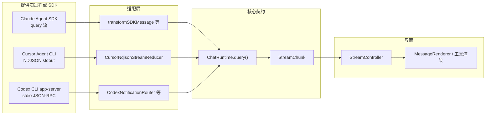

# 教程：Chat 多提供商对接原理（Claude / Cursor Agent / Codex）

本文基于当前 **Claudian** 仓库中的实现，说明三个聊天提供商如何接入 Obsidian 侧栏、工具调用与「思考」类输出如何进入统一界面，以及是否都依赖各自的官方 SDK。

---

## 1. 先给结论：不是「三个都用同一种 SDK」

| 提供商 | 接入方式 | 是否使用本仓库 `package.json` 中的官方 npm SDK |
|--------|----------|-----------------------------------------------|
| **Claude（Claude Code）** | **`@anthropic-ai/claude-agent-sdk`**：`query()` 流式消费 SDK 消息 | **是**（`@anthropic-ai/claude-agent-sdk`） |
| **Cursor Agent** | 本机 **Cursor Agent CLI**：`child_process.spawn`，读 **stdout 每行 NDJSON** | **否**（无 Cursor npm 包；对齐官方 CLI 的 `stream-json` 输出） |
| **Codex** | 本机 **Codex CLI** 子进程：`app-server --listen stdio://`，**JSON-RPC 2.0** 行协议 | **否**（未使用 OpenAI 官方 Node SDK；协议由 Codex 可执行文件提供） |
| **MCP（跨功能）** | **`@modelcontextprotocol/sdk`** 用于 MCP 客户端/探测等 | **是**（与「聊天模型提供商」是不同一层） |

因此：**只有 Claude 这条线是直接嵌官方 Agent SDK**；Cursor 与 Codex 都是 **启动外部 CLI/子进程 + 解析其输出或 RPC 通知**，再在插件内归一成同一种流式事件。

---

## 2. 为什么界面上看起来「统一、像在用原版智能体」？

核心原因是 **两层抽象**：

1. **运行时契约 `ChatRuntime`**  
   每个提供商实现自己的 `ChatRuntime`（例如 `ClaudeChatRuntime`/`ClaudianService`、`CursorChatRuntime`、`CodexChatRuntime`），对外暴露相同的生命周期与 `query()` 异步生成器。

2. **流式事件契约 `StreamChunk`**  
   各提供商在进程/SDK 内部协议各异，但都必须在进入功能层之前 **归一化**为 `StreamChunk`（`src/core/types/chat.ts` 中定义）。  
   聊天 UI 的 **`StreamController`** 只认识 `StreamChunk`，按类型渲染：正文、思考块、工具调用、子智能体、用量、`done` 等。

也就是说：**「像原版」是因为底层真的在跑对应的 Claude SDK / Cursor CLI / Codex app-server**；**「界面统一」是因为中间强制做了协议 → `StreamChunk` 的适配层**。

---

## 3. 统一数据流（从提供商到界面）

---

## 4. Claude：官方 Agent SDK + 消息变换

### 4.1 依赖与职责

- 依赖：`package.json` 中的 `@anthropic-ai/claude-agent-sdk`。
- 运行时类在 `src/providers/claude/runtime/ClaudeChatRuntime.ts`（导出名为 `ClaudianService`），注释中写明：**持久化 query**、MessageChannel、权限、MCP、会话等均由 SDK 侧能力组合而成。

### 4.2 从 SDK 消息到 `StreamChunk`

`src/providers/claude/stream/transformClaudeMessage.ts` 中的 `transformSDKMessage` 将 **`SDKMessage`** 拆成多条 **`StreamChunk`**（例如文本、`tool_use` / `tool_result`、子智能体上的 `subagent_*`、thinking、usage、`context_compacted` 等）。

这样 **工具调用、思考过程、错误子类型** 等都以统一 chunk 类型进入 `StreamController`。

### 4.3 子进程与 Electron 兼容

`src/providers/claude/runtime/customSpawn.ts` 为 SDK 提供 **自定义 spawn**：例如把 `node` 解析为完整路径、以及在 Obsidian Electron 环境下 **避免把 AbortSignal 直接传给 Node spawn**（注释中说明了 realm 不兼容问题）。  
这说明：**即使用 SDK，底层仍然是「起子进程跑 Agent」**，只是由 SDK 封装协议，而不是手写 NDJSON。

### 4.4 历史与会话

Claude 侧大量代码读写 **SDK 落盘的 session**（如 `src/providers/claude/history/sdkSessionPaths.ts` 等），与「会话由 SDK 持久化、插件存元数据」的设计一致。

---

## 5. Cursor：无 npm SDK，对齐 CLI 的 NDJSON 流

### 5.1 启动方式

`src/providers/cursor/runtime/CursorChatRuntime.ts` 的 `query()`：

- 解析本机 **Cursor Agent CLI** 路径；
- 使用 `spawnCursorCli`（`cursorSpawn.ts`）跨平台启动；
- 将 **stdout 按行读取**，每行当作一条 JSON。

### 5.2 协议还原：`CursorNdjsonStreamReducer`

`src/providers/cursor/runtime/cursorStreamMapper.ts` 中的 **`CursorNdjsonStreamReducer`**：

- 解析 `type === 'assistant'`、`tool_call`（`started` / `completed`）、`result` 等记录；
- 按官方 **`--output-format stream-json`** 与 **`--stream-partial-output`** 的语义处理增量与重复（文件内注释指向 Cursor 文档）；
- 输出 **`StreamChunk`**：`text`、`tool_use`、`tool_result`、`error`、`usage`+`done` 等。

**这里没有「Cursor JavaScript SDK」**：集成边界是 **CLI 文本协议**，与 Claude/Codex 的集成形态都不同。

---

## 6. Codex：CLI `app-server` + JSON-RPC + 通知路由

### 6.1 如何启动

`src/providers/codex/runtime/CodexLaunchSpecBuilder.ts` 将启动参数固定为：

- `app-server --listen stdio://`

即：**Codex 可执行文件作为应用服务器，监听标准输入输出**，而不是在插件里直接调 OpenAI HTTP API。

### 6.2 传输层

`src/providers/codex/runtime/CodexRpcTransport.ts`：

- 向子进程 **stdin 写入一行一个 JSON**（`jsonrpc: '2.0'`、`request` / `notification`）；
- 从 **stdout 按行读回**，分发响应、服务端通知、服务端发起的 request。

初始化见 `src/providers/codex/runtime/codexAppServerSupport.ts` 的 `initialize` / `initialized` 握手。

### 6.3 通知 → `StreamChunk`

`src/providers/codex/runtime/CodexNotificationRouter.ts` 将 Codex 的细粒度通知（如 `item/agentMessage/delta`、`item/reasoning/textDelta`、`item/started` / `item/completed` 等）**映射**为统一的 `StreamChunk`：

- 推理摘要/推理正文增量 → `thinking`；
- 代理消息增量 → `text`；
- 命令执行、文件变更、MCP 工具调用等 → `tool_use` / `tool_result`（并经过 `codexToolNormalization` 等规范化）。

因此 Codex 的「思考、工具、正文」与 Claude/Cursor 在 UI 层走的是 **同一套 chunk 类型**。

---

## 7. 界面层如何消费 `StreamChunk`

`src/features/chat/controllers/StreamController.ts` 的 `handleStreamChunk` 根据 `chunk.type` 分支：

- `thinking` → 思考块渲染（并处理与正文之间的冲刷顺序）；
- `text` → 追加助手正文；
- `tool_use` / `tool_result` / `tool_output` → 工具卡片、diff、子智能体（含 `ProviderSubagentLifecycleAdapter` 等扩展点）；
- `usage`、`done`、`error`、`context_compacted` 等 → 用量、结束、错误、上下文压缩边界。

**提供商差异在到达 `handleStreamChunk` 之前就应已消除**；这是体验一致的关键。

---

## 8. MCP 与「聊天提供商」的关系（避免混淆）

- `package.json` 中的 **`@modelcontextprotocol/sdk`** 用于 MCP 协议相关的客户端能力（例如 `src/core/mcp/` 下的测试与传输）。
- **Claude** 的 MCP 服务器列表、禁用工具等，主要通过 **Agent SDK 的选项** 传入（见 `McpServerManager` 等与 SDK 的衔接）。
- **Codex** 在运行时里对 MCP 有「由 Codex 内部处理」的表述（例如 `reloadMcpServers` 可为 no-op），与 Claude 的 SDK 集成路径不同。

---

## 9. 小结表（实现事实）

| 问题 | 答案 |
|------|------|
| 是否都用各自「聊天 SDK」？ | **否**。仅 Claude 使用 **`@anthropic-ai/claude-agent-sdk`**。 |
| Cursor 靠什么协议？ | **Cursor Agent CLI 的 NDJSON（stream-json）**，类 `CursorNdjsonStreamReducer` 解析。 |
| Codex 靠什么协议？ | **Codex CLI `app-server` 的 stdio JSON-RPC + 通知**，类 `CodexRpcTransport` / `CodexNotificationRouter`。 |
| 为什么工具/思考能统一展示？ | 各适配层把原生事件转为 **`StreamChunk`**，**`StreamController`** 单一入口渲染。 |
| 「像原版」的原因？ | 实际执行仍是 **官方 SDK 或官方 CLI 进程**，插件主要负责 **编排、设置、路径、会话元数据与 UI**。 |

---

## 10. 自测阅读路径（想顺着代码读时）

1. 契约：`src/core/runtime/ChatRuntime.ts`、`src/core/types/chat.ts`（`StreamChunk` 注释）。  
2. Claude：`src/providers/claude/runtime/ClaudeChatRuntime.ts`、`src/providers/claude/stream/transformClaudeMessage.ts`。  
3. Cursor：`src/providers/cursor/runtime/CursorChatRuntime.ts`、`src/providers/cursor/runtime/cursorStreamMapper.ts`。  
4. Codex：`src/providers/codex/runtime/CodexLaunchSpecBuilder.ts`、`CodexRpcTransport.ts`、`CodexNotificationRouter.ts`。  
5. UI：`src/features/chat/controllers/StreamController.ts`（`handleStreamChunk`）。

---

*文档版本：与仓库实现同步描述，若上游 CLI/SDK 行为变更，以代码为准。*
